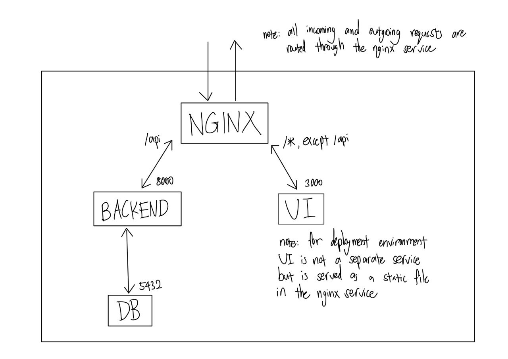
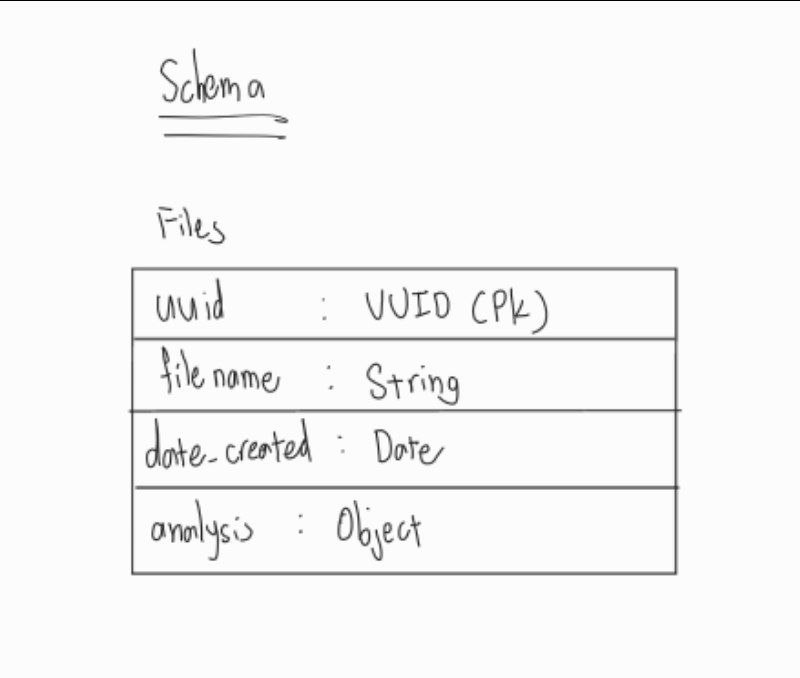

# cloudsine_technical

This repository contains a web application developed for Cloudsine's technical assessment. The application integrates with the VirusTotal API to allow users to securely upload files and scan them for malware or viruses.

## Requirements
- docker

## Getting started

### Clone repository
```shell
git clone https://github.com/leesean5150/cloudsine_technical.git
```
```shell
git submodule update --init --recursive
```
to initialise and pull the webtest submodule for the test files

### Populate .env file
```shell
cp .env.sample .env
```
open .env file and fill in the required information

### Start up docker containers

```shell
docker compose up
```

## Web Architecture

- Nginx service (NGINX) - this should be the only thing exposed on the actual server
- React frontend (UI)
- FastAPI backend (BACKEND)
- PostgreSQL database (DB)

